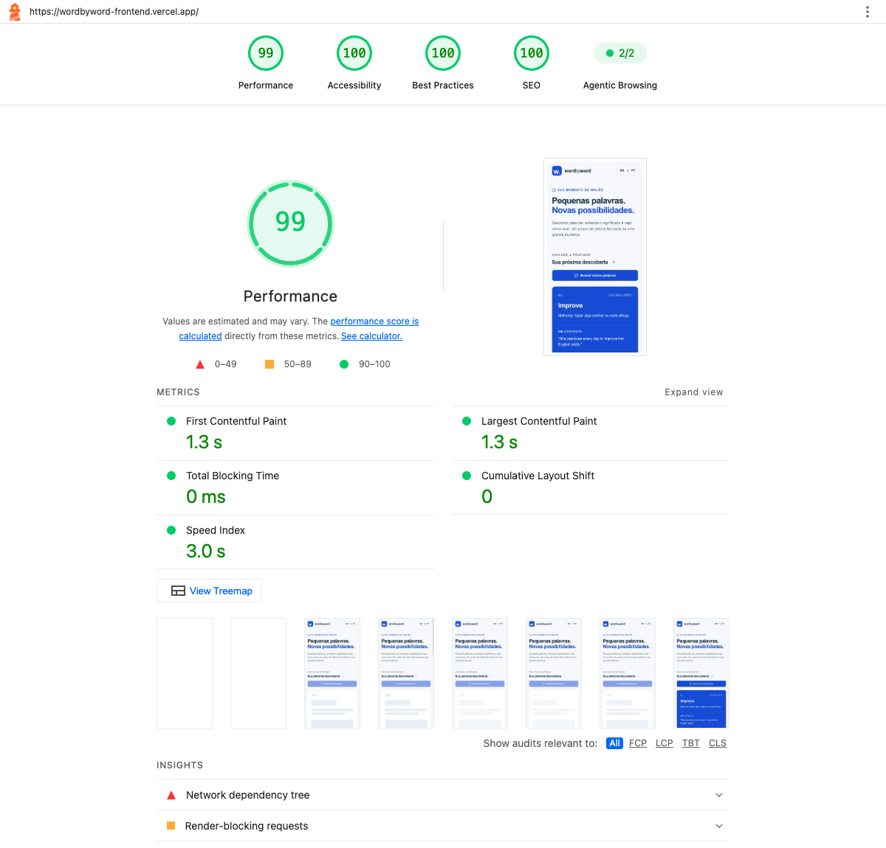
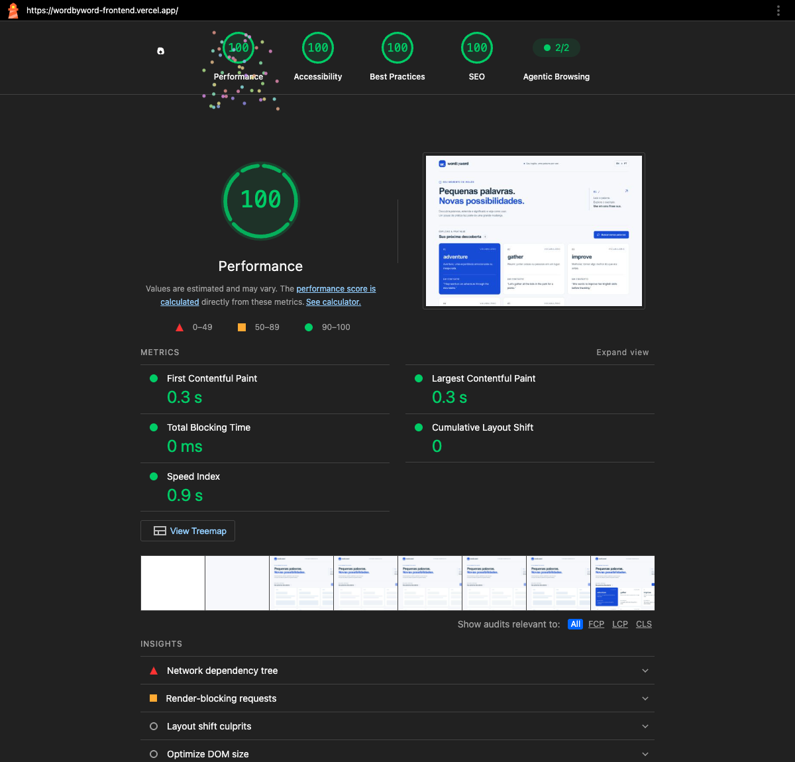

# Word by Word

Uma palavra pode abrir uma nova possibilidade. **Word by Word** é um site para praticar vocabulário em inglês: consulte cinco palavras, leia a explicação e explore um exemplo de uso em contexto.

Projeto da disciplina **Front-end Engineering — FIAP**.


## Links do projeto

- [Site principal na Vercel](https://wordbyword-frontend.vercel.app)
- [Publicação alternativa no Sites](https://wordbyword-fiap-victor-marjorie.victornunesdev.chatgpt.site)
- [Frontend no GitHub](https://github.com/victornunes-eng/wordbyword-frontend)
- [API no GitHub](https://github.com/victornunes-eng/wordbyword-api)
- [Endpoint público de palavras](https://wordbyword-api.vercel.app/ask)
- [Saúde da API](https://wordbyword-api.vercel.app/health)

## Integrantes

| Integrante | RM |
| --- | --- |
| Victor Santana Nunes da Silva | 369361 |
| Marjorie Nunes Ribeiro | 366725 |

## Funcionalidades

- Consulta ao BFF usando o contrato `{ word, description, useCase }`.
- Cartões com palavra, significado e frase de exemplo.
- Busca de novas palavras sem recarregar a página.
- Interface responsiva para celular, tablet e desktop.
- Estados de carregamento, lista vazia, erro e nova tentativa.
- Cancelamento e timeout de requisições; preservação das palavras anteriores se uma nova consulta falhar.
- HTML semântico, indicação de foco, link para pular ao conteúdo, mensagens acessíveis e respeito à preferência por movimento reduzido.

## Tecnologias

| Tecnologia | Papel |
| --- | --- |
| React 19 + TypeScript | Interface e estado das consultas. |
| Vinext + Vite | Compilação da aplicação com estrutura App Router. |
| Tailwind CSS + CSS próprio | Estilos e layout responsivo. |
| Shadcn / Base UI | Botões e esqueletos de carregamento. |
| Lucide | Ícones de interface. |
| Vercel | Publicação estática principal do frontend e hospedagem da API. |
| Sites / Cloudflare Workers | Publicação alternativa do mesmo frontend. |
| Node.js + OpenAI | API própria, mantida em repositório separado. |

O frontend não recebe a chave da OpenAI. Ele conhece apenas o endereço público da API.

## Executar localmente

Pré-requisitos: Node.js 22.13 ou superior e npm.

```bash
npm ci
cp .env.example .env.local
npm run dev
```

Abra a URL local informada pelo terminal, normalmente `http://localhost:3000`.

No arquivo `.env.local`, configure:

```dotenv
NEXT_PUBLIC_API_URL=http://localhost:3001/ask
```

Execute a API própria em outro terminal conforme seu README. Para testar o BFF da aula, use `https://fiap-bff-10aojr.onrender.com/ask`. O site utiliza essa URL quando a variável não está definida; o deploy final deve apontar explicitamente para a API própria. A língua da explicação depende do provedor; a API própria solicita português.

## Compilar e verificar

```bash
npx tsc --noEmit
npm run build
npm start
```

`npm start` executa localmente o Worker compilado com Wrangler. O comando de build gera `dist/client` e `dist/server`; não publique `dist/server` como arquivos estáticos.

## Publicar na Vercel

1. Importe este repositório na Vercel com o framework **Vite**.
2. Defina `NEXT_PUBLIC_API_URL=https://wordbyword-api.vercel.app/ask` nas variáveis de produção.
3. A configuração `vercel.json` executa `npm run build:vercel` e publica a pasta `build`.
4. Realize o deploy em produção e confirme que o endereço está acessível sem login.
5. Na API, mantenha a origem pública do frontend em `ALLOWED_ORIGINS`.

Pela CLI:

```bash
npx vercel login
npx vercel link
npx vercel env add NEXT_PUBLIC_API_URL production
npx vercel --prod
```

A variável é pública e incorporada ao JavaScript na compilação. Alterá-la exige novo build e deploy. Nunca use prefixo `NEXT_PUBLIC_` para segredos. A pasta `api/` deste ambiente local é um repositório independente e está excluída do Git e do upload do frontend.

Para conferir a versão estática localmente:

```bash
npm run build:vercel
npm run preview:vercel
```

### Publicação alternativa no Sites

A mesma interface também pode ser compilada com `npm run build` e publicada no Sites, sobre Cloudflare Workers. O identificador está em `.openai/hosting.json`. Defina `NEXT_PUBLIC_API_URL` antes do build, salve a versão e publique com acesso público. Essa compilação produz `dist/client` e `dist/server`; não sirva os arquivos do servidor como estáticos.

A versão principal usa Vercel para reduzir o impacto de scripts da hospedagem identificado na primeira medição. As duas compilações reutilizam `app/page.tsx` e `app/globals.css`; não há duas implementações da interface.

Para uma instância em outra conta do Sites, registre um novo site e use o identificador retornado. O identificador deste projeto não transfere acesso à conta original.

## Estrutura

```text
app/page.tsx          Interface e consulta ao BFF
app/layout.tsx        Idioma e metadados
app/globals.css       Identidade visual e responsividade
components/ui/        Componentes de interface do scaffold
public/favicon.svg    Ícone do projeto
browser.tsx           Entrada da versão estática
vite.vercel.config.ts Compilação estática para Vercel
vercel.json           Configuração de publicação
.env.example          Exemplo de configuração, sem segredos
docs/                 Evidências e documentação da entrega
```

## Lighthouse e Web Vitals

Auditoria realizada em **07/09/2026**, com **Lighthouse 13.4.1**, sobre [a versão pública na Vercel](https://wordbyword-frontend.vercel.app/). Perfil móvel às 15h51 e desktop às 15h52 (horário de Brasília), com as configurações padrão de cada perfil e Chrome headless sem extensões. As duas execuções terminaram sem avisos ou erros de auditoria.

| Perfil | Desempenho | Acessibilidade | Boas práticas | SEO |
| --- | ---: | ---: | ---: | ---: |
| Móvel | **99** | **100** | **100** | **100** |
| Desktop | **100** | **100** | **100** | **100** |

| Métrica | Móvel | Desktop |
| --- | ---: | ---: |
| FCP | 1,3 s | 0,3 s |
| LCP | 1,3 s | 0,3 s |
| Speed Index | 3,0 s | 0,9 s |
| TBT | 0 ms | 0 ms |
| CLS | 0 | 0 |

### Prints e relatórios originais





- [Relatório móvel em HTML](docs/lighthouse-mobile.report.html) e [dados originais em JSON](docs/lighthouse-mobile.report.json).
- [Relatório desktop em HTML](docs/lighthouse-desktop.report.html) e [dados originais em JSON](docs/lighthouse-desktop.report.json).
- [PDF de entrega para a FIAP](docs/entrega-fiap.pdf).

Para abrir os relatórios interativos, baixe o HTML pelo botão **Raw/Download** do GitHub e abra no navegador. Os prints acima permitem conferir as notas diretamente no README.

### Como reproduzir

Com Google Chrome instalado, execute na raiz do repositório:

```bash
npx --yes lighthouse@13.4.1 https://wordbyword-frontend.vercel.app --chrome-flags="--headless=new --disable-extensions" --output=html --output=json --output-path=./docs/lighthouse-mobile
npx --yes lighthouse@13.4.1 https://wordbyword-frontend.vercel.app --preset=desktop --chrome-flags="--headless=new --disable-extensions" --output=html --output=json --output-path=./docs/lighthouse-desktop
```

### O significado de cada métrica

| Métrica | O que significa |
| --- | --- |
| FCP — First Contentful Paint | Tempo até aparecer o primeiro conteúdo de texto ou imagem. |
| LCP — Largest Contentful Paint | Tempo até aparecer o maior elemento de conteúdo visível. |
| Speed Index | Rapidez com que o conteúdo visível é preenchido durante o carregamento. |
| TBT — Total Blocking Time | Soma dos períodos de tarefas longas que bloqueiam a thread principal durante a medição. |
| CLS — Cumulative Layout Shift | Instabilidade visual causada por mudanças inesperadas de posição dos elementos. |

**Lighthouse é uma medição de laboratório.** Os Core Web Vitals atuais são LCP, INP e CLS. O relatório padrão de navegação não comprova o INP de usuários reais; TBT ajuda a diagnosticar bloqueios, mas não é o mesmo que INP. As notas variam com dispositivo, rede e execução. Um site novo pode não ter dados de campo suficientes.

Medidas adotadas: fontes do sistema sem downloads externos, ausência de imagens pesadas, ícones vetoriais, CSS gerado somente para os componentes usados, publicação estática na Vercel e espaços reservados durante a consulta.

- [Google — Lighthouse performance scoring](https://developer.chrome.com/docs/lighthouse/performance/performance-scoring)
- [Google — Web Vitals](https://web.dev/articles/vitals)

## Referência didática

[BFF de Jaison Schmidt](https://github.com/jaisonschmidt/fiap-bff), indicado no enunciado da disciplina. O frontend e a API própria foram escritos para este trabalho, com auxílio de IA na implementação e documentação.
